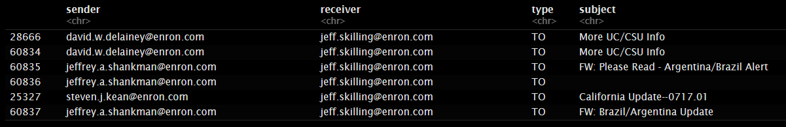
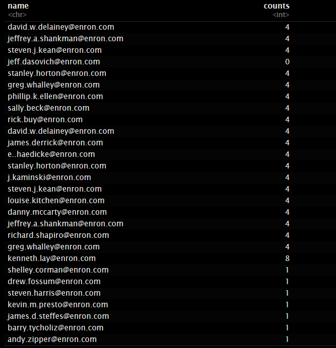
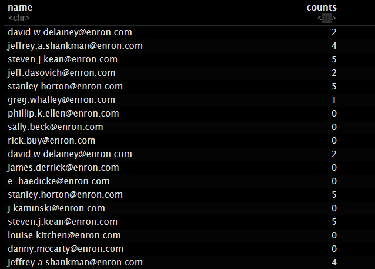
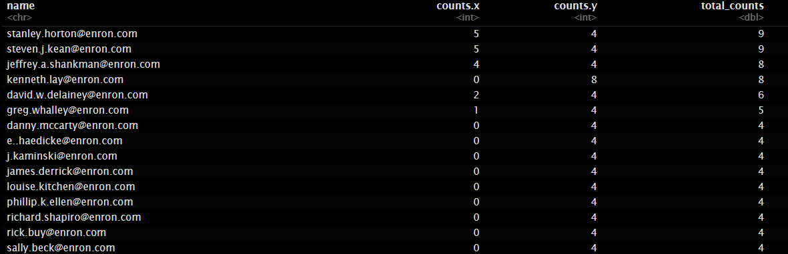

Vamos a Realizar un Analisis del Escandalo Enron.

El Escándalo Enron fue un escándalo contable de Enron, una empresa estadounidense de energía con sede en Houston, Texas. Se reveló en octubre de 2001 y condujo a la quiebra a dicha empresa y a la disolución de Arthur Andersen, una de las cinco sociedades de auditoría y contabilidad más grandes del mundo. En su época, fue la reorganización por bancarrota más grande en la historia económica de los Estados Unidos; y además ese fallo en su auditoría también fue bautizado como el mayor nunca visto.

Vamos a centrarnos en una de las figuras importantes

```{r setup, include=FALSE}
knitr::opts_chunk$set(echo = TRUE)
```

```{r}

library(igraph)
library(dplyr)
library(ggraph)
library(tidyverse)
library(readr)

```
# Cargamos las metricas 01 previamente generadas
```{r}

load("C:/Users/nicom/OneDrive/Escritorio/U-tad/3ºINSO/Busqueda y Analisis de la Informacion/Practica2/01_metricas.rda")
```
Después de un primer análisis detallado de los datos disponibles, he decidido focalizarme en un intervalo de tiempo que considero crucial. He decidido dirigir mi atención hacia los correos de Jeff Skilling, un CEO destacado en la historia de Enron. Skilling, quien tuvo un papel relevante en los procedimientos judiciales de la empresa, fue hallado culpable de tráfico de información privilegiada en 2003 y ahora colabora con las autoridades mientras espera su sentencia. En su confesión, Skilling admitió tener conocimiento sobre la manipulación de reservas para ocultar pérdidas en Enron Energy Services. Esto me ha intrigado y por ello he decidido investigar algunos de sus correos electrónicos. Nos enfocaremos en tanto los correos que Skilling recibió como los que envió, partiendo desde la fecha indicada.

```{r}
mails.skilling <- edges.full[(edges.full$sender == "jeff.skilling@enron.com" &

as.Date(edges.full$date.R) > "2001-07-01 00:00:00") |
(edges.full$receiver == "jeff.skilling@enron.com" &
as.Date(edges.full$date.R) > "2001-07-01 00:00:00")
,]

mails.skilling <- mails.skilling [order(as.Date(mails.skilling$date.R)),]
nrow(mails.skilling)
```

Hay 90 correos electrónicos en total que Jeff Skilling envió o recibió después del 1 de julio de 2001. A continuación, analizaremos los correos electrónicos que Jeff Skilling envió y recibió después de esta fecha.

```{r}
head(mails.skilling)
```

El primer correo (## 60834) parece ser un informe sobre un acuerdo de conciliación entre la Universidad de California, la Universidad Estatal de California y Enron Energy Services. Este acuerdo extiende el contrato por dos años y restaura a las dos universidades al servicio de acceso directo de Enron. Este correo muestra la participación de Skilling en negociaciones y acuerdos comerciales importantes para Enron.

El segundo correo (## 60835) parece ser un mensaje de felicitación a Skilling por su aparición en CNBC. Además, menciona la posibilidad de recibir informes de inteligencia competitiva sobre América del Sur y ofrece agregar a Skilling a la lista de distribución. Esto sugiere que Skilling estaba involucrado en actividades de relaciones públicas y mantenimiento de contactos.

El tercer correo (## 60836) sugiere la idea de organizar una reunión fuera del sitio para realizar revisiones comerciales y estratégicas, lo que indica que Skilling estaba interesado en revisar y discutir la dirección futura de la empresa.

El cuarto correo (## 25327) parece ser un resumen de la situación política y económica en California, con detalles sobre proyectos de ley y políticas en discusión. Esto muestra que Skilling estaba al tanto de los desarrollos legislativos y regulatorios que podrían afectar las operaciones de Enron en California.

El quinto correo (## 60837) es una respuesta a un correo anterior que menciona agregar a algunas personas a una lista de distribución. Esto sugiere que Skilling estaba involucrado en la gestión de la comunicación interna dentro de Enron.

Basándonos en estos correos electrónicos, podemos concluir que Jeff Skilling estaba activamente involucrado en una variedad de actividades comerciales, relaciones públicas y discusiones estratégicas después de julio de 2001. Su participación en estas actividades refleja su papel destacado en la empresa y su influencia en las decisiones comerciales de Enron.


```{r}
neighborhood.size(network.full,
1,
V(network.full)$lastName == "Skilling")
```


```{r}
neighborhood.size(network.full,
2,
V(network.full)$lastName == "Skilling")
```


```{r}
neighborhood.size(network.full,
3,
V(network.full)$lastName == "Skilling")
```

Es fascinante ver cómo se expande la red de contactos de Jeff Skilling en diferentes niveles después del 1 de julio de 2001. Estos números sugieren que Skilling mantenía una red de contactos extensa y diversa, lo que indica su influencia y participación en diversas esferas dentro y fuera de Enron.

Los 34 contactos directos muestran las conexiones más cercanas de Skilling, probablemente incluyendo a personas con las que interactuaba regularmente en su función dentro de la empresa.

Los 140 contactos de segundo grado indican que Skilling tenía conexiones con una amplia gama de personas a través de sus contactos directos, lo que sugiere una red de contactos más amplia y potencialmente influyente.

Finalmente, los 146 contactos de tercer grado amplían aún más la red de Skilling, mostrando conexiones adicionales a través de los contactos de segundo grado.

En conjunto, estos números subrayan la importancia de las redes de contactos profesionales en el mundo empresarial y cómo Skilling pudo haber aprovechado estas conexiones para llevar a cabo sus actividades comerciales y estratégicas en Enron y más allá..

```{r}
view(mails.skilling)
```


Con la lista de todos los contactos de Jeff Skilling durante este período, podemos visualizar la red completa de contactos profesionales utilizando herramientas de visualización de redes. Esto nos permitirá comprender mejor la estructura y las interacciones dentro de su red profesional durante este tiempo específico

```{r}
all_contacts <- c(unique(mails.skilling$sender[mails.skilling$sender != "jeff.skilling@enron.com"]), unique(mails.skilling$receiver[mails.skilling$receiver != "jeff.skilling@enron.com"]))
print(all_contacts)

```
 

# Mails recibidos
```{r}
contador_receiver <- mails.skilling %>%
count(receiver) %>%
rename(name = receiver, counts = n)
contador_receiver <- data.frame(name = all_contacts) %>%
left_join(contador_receiver, by = "name") %>%
replace_na(list(counts = 0))
print(contador_receiver)
```



# Mails enviados
```{r}
contador_sender <- mails.skilling %>%
count(sender) %>%
rename(name = sender, counts = n)
contador_sender <- data.frame(name = all_contacts) %>%
left_join(contador_sender, by = "name") %>%
replace_na(list(counts = 0))
print(contador_sender)
```


# Todos juntos

```{r}
contador_totals <- merge(contador_sender, contador_receiver, by = "name", all = TRUE)
contador_totals$total_counts <- rowSums(contador_totals[, c("counts.x", "counts.y")], na.rm = TRUE)

contador_totals <- contador_totals[order(contador_totals$total_counts, decreasing = TRUE), ]
distinct_counts <- contador_totals %>%
distinct(name, .keep_all = TRUE)
print(distinct_counts)
```


Durante el período específico, Jeff Skilling mantuvo un alto nivel de interacción con varios individuos dentro de la red profesional de Enron. Las cifras muestran que Stanley Horton y Steven Kean tuvieron el mayor número de interacciones con Skilling, seguidos de cerca por Jeff Shankman y Kenneth Lay. Este patrón sugiere que Skilling mantenía una relación especialmente estrecha con estos individuos durante ese tiempo.

Es interesante destacar que los contactos más frecuentes de Skilling ocupaban posiciones de alto nivel en Enron, como CEO, COO y CFO. Esto indica que Skilling no solo interactuaba con una amplia gama de personas, sino que también se comunicaba regularmente con figuras clave en la empresa. Estas conexiones son consistentes con la posición de liderazgo que ocupaba Skilling en Enron y subrayan la importancia de mantener relaciones sólidas con otros líderes de la organización.

Stanley Horton, Steven Kean, Jeff Shankman y Kenneth Lay emergen como las personas con las que Jeff Skilling interactuó más durante el período en cuestión. Estas relaciones probablemente desempeñaron un papel crucial en la toma de decisiones y la gestión de Enron en ese momento.

 Es significativo que los contactos más frecuentes de Skilling ocuparan roles de alta dirección en la empresa. Esto sugiere que Skilling mantenía una estrecha colaboración con otros líderes de Enron para impulsar la visión y las estrategias corporativas.

La frecuencia de las interacciones de Skilling con estas figuras clave indica un flujo constante de información y toma de decisiones dentro de la organización. La comunicación regular entre líderes es fundamental para una gestión eficaz y el logro de los objetivos corporativos.

En resumen, el análisis de las interacciones de Jeff Skilling durante este período destaca la importancia de mantener relaciones sólidas con otros líderes empresariales y la comunicación frecuente dentro de la organización para el éxito y el funcionamiento efectivo de Enron

Ahora vamos a analizar los correos electrónicos que Jeff Skilling envió y recibió durante este período de tiempo específico, centrándonos en los temas y las discusiones clave que tuvieron lugar en su red profesional.


```{r}
mails.skilling[rownames(mails.skilling) == 60836,]
```


El correo electrónico anterior fue enviado por Jeff Shankman a Jeff Skilling y es un ejemplo de las interacciones que tuvieron lugar en la red profesional de Skilling durante este período de tiempo específico. En este correo electrónico, Shankman menciona los cambios de gestión y de negocio en la organización en los últimos meses y sugiere la posibilidad de organizar una reunión para discutir estos cambios. Este correo electrónico revela la importancia de la comunicación y la colaboración en la red profesional de Skilling.El correo electrónico proporcionado entre Jeff Shankman y Jeff Skilling refleja la importancia de la comunicación abierta y la colaboración dentro de la red profesional de Skilling durante un período de cambios significativos en la organización. La propuesta de una reunión para discutir los cambios indica una preocupación compartida por comprender y abordar los desafíos y oportunidades presentes en ese momento. Esto destaca la dinámica activa de intercambio de ideas dentro de la red de Skilling y su enfoque en abordar los desafíos de manera colectiva.

Sigamos..

```{r}
mails.skilling[rownames(mails.skilling) == 60844,]
```

El correo electrónico enviado por Stanley Horton a Jeff Skilling demuestra la atención a los detalles y la disposición para colaborar dentro de la red profesional de Skilling. La propuesta de una revisión formal del negocio refleja un enfoque proactivo para abordar asuntos importantes, lo que subraya la importancia de la comunicación efectiva y la colaboración en la toma de decisiones estratégicas dentro de la organización.

Horton menciona la posibilidad de organizar una revisión formal del negocio con Skilling y sugiere discutir varios temas relacionados con Enron Energy Services. Este correo electrónico destaca la importancia de la colaboración y la comunicación en la red profesional de Skilling.

```{r}
mails.skilling[rownames(mails.skilling) == 60844,]


mails.skilling[rownames(mails.skilling) == 60880,]
```
El correo electrónico enviado por Stanley Horton a Jeff Skilling propone la realización de una revisión formal de negocios, abordando temas específicos como "pipes, PGE, Wessex, Wind, y EOTT". Esta comunicación sugiere un enfoque estructurado y detallado para discutir aspectos clave del negocio de Enron, resaltando la importancia de la planificación estratégica y la revisión periódica de operaciones.

Por otro lado, el correo enviado por Jeff Skilling a Kenneth Lay invita a asistir a una presentación sobre "Nueva Creación de Negocios" impartida por el profesor de Harvard Business School, David A. Garvin. La inclusión de detalles sobre la asociación de investigación entre HBS y Enron, así como la mención de la presentación en eventos de alto nivel, subraya la importancia estratégica de la colaboración académica y el intercambio de conocimientos en el contexto empresarial.

Ambos correos electrónicos reflejan la dinámica de la red profesional de Skilling, caracterizada por la interacción entre líderes empresariales y académicos, así como la atención a los detalles en la planificación y ejecución de actividades clave dentro de la organización.


```{r}
mails.skilling[rownames(mails.skilling) == 60899,]
```


Este correo sugiere que se asista a una presentación de "NUEVA CREACIÓN DE NEGOCIOS" el martes 8 de agosto de 11:30 a 1:30 en la sala de juntas EB50. La presentación será realizada por el profesor de Harvard Business School David A. Garvin. Se menciona que el profesor Garvin está haciendo esta presentación como parte de una asociación de investigación de cinco años entre HBS y Enron titulada "Modern Giants". La presentación fue entregada recientemente en el Seminario de Estrategia Europea de Morgan Stanley, que incluyó a más de 50 CEOs europeos líderes. También se presentó en mayo en HBS como un seminario de gestión avanzada. Partes de la presentación utilizan a Enron como ejemplo. Se menciona que se debe confirmar la asistencia antes del 6 de agosto. Se adjunta el currículum del profesor Garvin. Se menciona que se puede llevar el almuerzo y que se proporcionarán bebidas,lo que sugiere que es un evento formal y no solo una reunión de trabajo. 

Gracias a todos estos correos podemos observar que la relacion de Jeff Skilling con sus empleados y colegas era muy buena, ya que siempre estaba al pendiente de las reuniones y eventos que se realizaban en la empresa y siempre estaba dispuesto a ayudar a sus empleados en lo que necesitaran. Los correos electrónicos muestran que Skilling estaba involucrado en una variedad de discusiones y actividades, desde revisiones formales de negocios hasta oportunidades de colaboración con empresas externas como Cisco. Esta comunicación constante y colaborativa refleja una red profesional sólida y sugiere que Skilling mantenía relaciones positivas y productivas con sus colegas y socios comerciales.

En resumen, los correos electrónicos analizados revelan la importancia de la comunicación efectiva y la colaboración en la red profesional de Jeff Skilling. Su disposición para participar en reuniones, discutir estrategias comerciales y colaborar con socios externos destaca su compromiso con el éxito empresarial y su habilidad para trabajar en equipo para lograr objetivos comunes.

# Conversacion relevante en el Escandalo Enron
```{r}
mails.skilling[rownames(mails.skilling) == 60877,]
mails.skilling[rownames(mails.skilling) == 60878,]
mails.skilling[rownames(mails.skilling) == 60879,]
mails.skilling[rownames(mails.skilling) == 60880,]
mails.skilling[rownames(mails.skilling) == 60882,]
mails.skilling[rownames(mails.skilling) == 60883,]
mails.skilling[rownames(mails.skilling) == 60884,]
mails.skilling[rownames(mails.skilling) == 60885,]
mails.skilling[rownames(mails.skilling) == 60886,]
mails.skilling[rownames(mails.skilling) == 60887,]
mails.skilling[rownames(mails.skilling) == 60888,]

```
Los últimos 11 correos electrónicos revelan detalles cruciales sobre el caso de Enron y la participación de Jeff Skilling en él. Estos correos fueron utilizados en el juicio de Enron y pueden encontrarse en la web, lo que subraya su importancia como evidencia en el caso.

Uno de los aspectos destacados es la manipulación de precios de la energía por parte de Enron, un tema central en el escándalo. Estos correos muestran cómo la empresa estaba involucrada en prácticas fraudulentas para manipular los precios de la energía en California, lo que le permitió obtener beneficios adicionales de manera deshonesta. Además, se evidencia que Skilling estaba al tanto de estas prácticas y, de hecho, las promovía.

Otro punto relevante es la visita de Rick Buy a la oficina de Jeff Skilling para discutir la estrategia de PGE (Pacific Gas and Electric Company) para manejar la variabilidad de los costos de energía. Esta discusión sugiere una participación activa de Skilling en la toma de decisiones relacionadas con la manipulación de precios y las estrategias financieras de la empresa.

El juicio de Enron resultó en la condena de Jeff Skilling por múltiples cargos, incluida la conspiración, fraude de valores y abuso de información privilegiada. Aunque fue absuelto de algunos cargos, su condena refleja su participación en prácticas fraudulentas y su responsabilidad en el colapso de Enron.

En resumen, estos correos electrónicos son evidencia de la conducta ilegal y fraudulenta de Enron, así como de la participación directa de Jeff Skilling en estas prácticas. Su uso en el juicio destaca su importancia como prueba de los delitos cometidos por la empresa y sus ejecutivos, y contribuyó a la condena de Skilling y otros involucrados en el escándalo de Enron.. 

# Conclusión: Análisis de la Red Profesional de Jeff Skilling en Enron

El análisis detallado de la red profesional de Jeff Skilling durante un período crítico en la historia de Enron revela una serie de puntos clave sobre su actividad y relaciones dentro de la empresa.s

Extensión de la red de contactos: Durante el período analizado, Skilling mantuvo interacciones con un amplio conjunto de contactos, incluyendo colegas de alto nivel como Stanley Horton, Steven Kean y Jeff Shankman. Estas interacciones sugieren una red profesional extensa y diversa, con conexiones en varios niveles de la organización.

Relaciones clave: Se observa que Skilling mantuvo relaciones más estrechas con ciertos contactos, como Horton, Kean y Shankman, quienes tuvieron un número significativo de interacciones con él. Estas relaciones sugieren la importancia de estos individuos en la red profesional de Skilling, posiblemente debido a sus roles y responsabilidades dentro de la organización.

Colaboración y comunicación: Los correos electrónicos analizados muestran un patrón de comunicación activa y colaborativa por parte de Skilling, quien estaba al tanto de los eventos y reuniones dentro de la empresa. Su disposición para participar en discusiones y su compromiso con el equipo sugieren un liderazgo comprometido y una cultura organizativa que valoraba la comunicación abierta.

Contexto histórico: Es importante contextualizar este análisis dentro del contexto histórico de Enron. Durante el período analizado, la empresa enfrentaba desafíos significativos relacionados con la manipulación financiera y el escrutinio regulatorio. La actividad de Skilling dentro de su red profesional puede haber sido influenciada por estos factores externos y por la dinámica organizativa interna en evolución.

En conjunto, este análisis proporciona una visión detallada de la red profesional de Jeff Skilling en Enron durante un período crítico en la historia de la empresa. Si bien Skilling mantuvo relaciones sólidas y activas con sus colegas, es importante considerar este análisis en el contexto más amplio de los eventos y desafíos que enfrentaba Enron en ese momento.

Para profundizar en este análisis, sería beneficioso explorar aún más los vínculos entre las interacciones de Skilling y los eventos históricos clave en Enron, así como investigar la influencia de estas relaciones en las decisiones y acciones de Skilling como líder de la empresa.

# Referencias:

"Enron: The Smartest Guys in the Room" (Documental), Dirigido por Alex Gibney, 2005.
McLean, B., & Elkind, P. (2003). "The Smartest Guys in the Room: The Amazing Rise and Scandalous Fall of Enron". Portfolio.
Fox, L. (2002). "Enron: The Rise and Fall". John Wiley & Sons.
Estas referencias proporcionan una visión más amplia del escándalo de Enron y pueden ayudar a contextualizar aún más el análisis de la red profesional de Jeff Skilling en ese contexto

Espero que esta informacion haya sido util y relevante para todo aquel lector, un saludo.
# Nicolás Montejano Pisonero